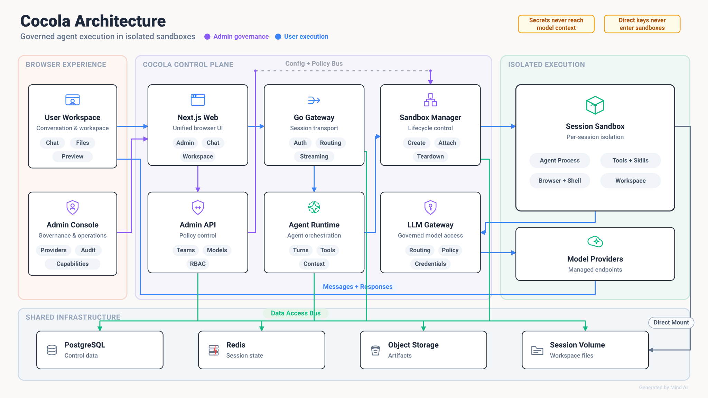

<div align="center">
  <h1>
    
  </h1>
  <p><strong>开源、自部署的团队 AI Agent 工作平台</strong></p>

  <p>
    <a href="#快速开始">快速开始</a> ·
    <a href="./docs">文档</a> ·
    <a href="./CONTRIBUTING.md">参与贡献</a> ·
    <a href="https://github.com/sakurs2/cocola/releases">Releases</a>
  </p>

  <p>
    <a href="https://github.com/sakurs2/cocola/actions/workflows/ci.yml"></a>
    <a href="https://github.com/sakurs2/cocola/releases"></a>
    <a href="./LICENSE"></a>
    <a href="./SECURITY.md"></a>
    <a href="./CONTRIBUTING.md"></a>
  </p>

  <p>
    <a href="./docs/cli.md"></a>
    <a href="./docs/cli.md"></a>
    <a href="https://github.com/opensandbox-group/OpenSandbox"></a>
    <a href="./docs/cli.md"></a>
  </p>

  <p>
    <a href="./apps/web/package.json"></a>
    <a href="./go.work"></a>
    <a href="./apps/agent-runtime/pyproject.toml"></a>
    <a href="./package.json"></a>
  </p>
</div>

<!--
产品图占位。建议使用一张 16:9 图片，同时展示对话执行过程与右侧 Workspace。


-->

Cocola 不只是一个模型聊天界面。每个会话都会获得独立、可持续使用的工作空间，Agent 可以读取文件、编写代码、运行命令、浏览网页，并将执行过程实时呈现在浏览器中。管理员则可以集中管理模型、用户、Skills、MCP、用量与审计。

## 核心能力

| Agent 工作流                                                                                         | 平台基础设施                                                                                            |
| ---------------------------------------------------------------------------------------------------- | ------------------------------------------------------------------------------------------------------- |
| 🧠 **原生 Agent Runtime**<br>支持 Claude Code 与 Codex，不把 Agent 简化成几组自定义工具。            | 🔒 **会话级隔离沙箱**<br>推理循环和原生工具运行在独立 OpenSandbox 环境中，工作区随会话持续保存。        |
| 🧰 **完整工作区**<br>在侧边栏直接使用 Files、Code、Shell、Git 和 Preview，实时查看执行状态与产物。   | 🔀 **统一模型入口**<br>集中管理模型 Provider 与路由，支持 Anthropic Messages 和 OpenAI Responses 协议。 |
| 🧩 **可复用能力**<br>通过自定义 Agent、Skills、MCP 和 Knowledge 组装团队的专属 Agent。               | 🛡️ **团队治理**<br>覆盖用户、用量、定时任务、运行追踪、审计日志和沙箱运维。                             |
| 🌿 **项目工作流**<br>支持本地与 GitHub Project；GitHub Task 使用独立工作分支，高风险写操作按次确认。 | 🏠 **完全自部署**<br>应用、模型密钥、对话数据和工作区都保留在自己的基础设施中。                         |

## 快速开始

正式部署使用 Cocola CLI。开始前需要：

- Linux 或 macOS，`amd64` 或 `arm64`；
- Docker Engine 或 Docker Desktop；
- Docker Compose 2.23.1 或更高版本。

**1. 安装**

下载最新版本并完成交互式配置：

```bash
curl -fsSL https://raw.githubusercontent.com/sakurs2/cocola/master/scripts/install.sh | sh
```

安装器会下载对应平台的 CLI、校验 SHA-256，并把部署配置写入 `~/.cocola`。Web 默认监听
所有网卡，可直接通过 `http://<server-ip>:3000` 访问，无需额外填写访问地址。请保存安装器
仅展示一次的管理员密码。

**2. 启动**

```bash
cocola start
```

**3. 配置模型**

打开 [http://localhost:3000](http://localhost:3000) 并登录。

> [!IMPORTANT]
> 首次启动后，请前往 `Admin → Models` 配置模型 Provider 和默认模型，然后再开始第一段对话。

<details>
<summary><strong>常用运维命令</strong></summary>

<br>

```bash
cocola status
cocola logs -f
cocola doctor
cocola stop
```

</details>

安装指定版本、使用外部 OpenSandbox 或进行非交互部署，请查看 [Cocola CLI 文档](./docs/cli.md)。

## 系统架构

<p align="center">
  
</p>

Cocola 将控制面和执行面分开：

1. Web 与 Gateway 负责登录鉴权、会话、SSE/WebSocket 流以及面向浏览器的统一入口。
2. Agent Runtime 是控制面路由器，负责准备环境并把一次 Run 转发到当前会话的 Sandbox。
3. Claude Code 或 Codex 连同原生工具运行在 Sandbox 内；文件通过 Session Volume 持久化。
4. LLM Gateway 统一连接模型 Provider，执行路由、凭证保护、配额和用量记账。
5. Admin API 管理用户、模型、Skills、MCP、调度、审计与平台配置。

核心基础设施包括 PostgreSQL、Redis、S3-compatible Object Storage 和 OpenSandbox。`v0.1.0` 的官方安装方式是由 Cocola CLI 管理的单机 Docker Compose；Sandbox 平面可以使用内置 OpenSandbox，也可以连接外部 OpenSandbox 服务。

主要技术栈：Next.js、TypeScript、Go、Python、gRPC、PostgreSQL、Redis、OpenSandbox。

## 本地开发

本地调试使用原生服务进程和容器化基础设施：

```bash
git clone https://github.com/sakurs2/cocola.git
cd cocola
cp .env.example .env
make dev
```

完整工具链、依赖安装和提交检查见 [CONTRIBUTING.md](./CONTRIBUTING.md)。

## 文档

完整文档站将随 `v0.1.0` 发布。在此之前，可以从以下仓库文档开始：

| 文档                                                      | 内容                             |
| --------------------------------------------------------- | -------------------------------- |
| [CLI 安装与运维](./docs/cli.md)                           | 安装、部署、诊断与日常运维       |
| [配置规范](./docs/configuration.md)                       | 环境变量与部署配置               |
| [Projects 与 GitHub Connector](./docs/github-projects.md) | 项目、任务和 GitHub 集成         |
| [对话可靠性](./docs/core-chat-reliability.md)             | Run 生命周期、断线重连与错误处理 |
| [架构决策记录](./docs/adr/README.md)                      | 关键架构选择及其背景             |

<!-- GitHub Pages 上线后，将本节链接替换为正式文档站 URL。 -->

## 参与贡献

欢迎提交 Issue 和 Pull Request。开始较大的功能或架构调整前，请先通过 [GitHub Issues](https://github.com/sakurs2/cocola/issues) 讨论范围，并阅读 [贡献指南](./CONTRIBUTING.md)。

安全问题请按照 [SECURITY.md](./SECURITY.md) 私密报告，不要创建公开 Issue。

## License

Cocola 使用 [Apache License 2.0](./LICENSE) 开源。
